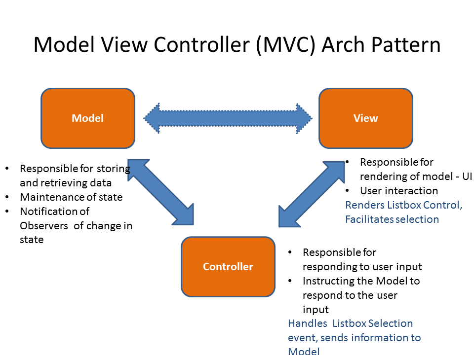

## My definition of design patterns 

I think of design patterns kind of like building blocks. I think of them such that they are fundamental methods to structuring code bases and developing applications, and that these building blocks are used to structure a plethora of different programs. Employing the use of design patterns makes it simpler to go about actually building a functional app because it isn’t trying to reinvent the wheel, it’s sticking to solutions that work. 

## Design patterns used in my final project 

The major design pattern that is used in my group’s final project is the Model-View-Controller (MVC) design pattern. I think that the project employs MVC because first of all, Prisma handles the Model side, as it handles the storing and retrieval of data into the database. Next, the React pages are the View side of the design pattern, as they render the user interface for the users to interact with. Finally for the Controller side of the application, React Controllers and Hooks handles user input and instructs the Model to add that user input to the database. 

## Benefit of MVC

Another benefit of using design patterns like MVC is that they make the project easier to maintain and improve over time. Since the pattern gives the team a common structure and vocabulary, everyone knows where different logic should go and where to look when something needs to be fixed. This helps reduce confusion, speeds up development, and supports better collaboration as the project grows.
