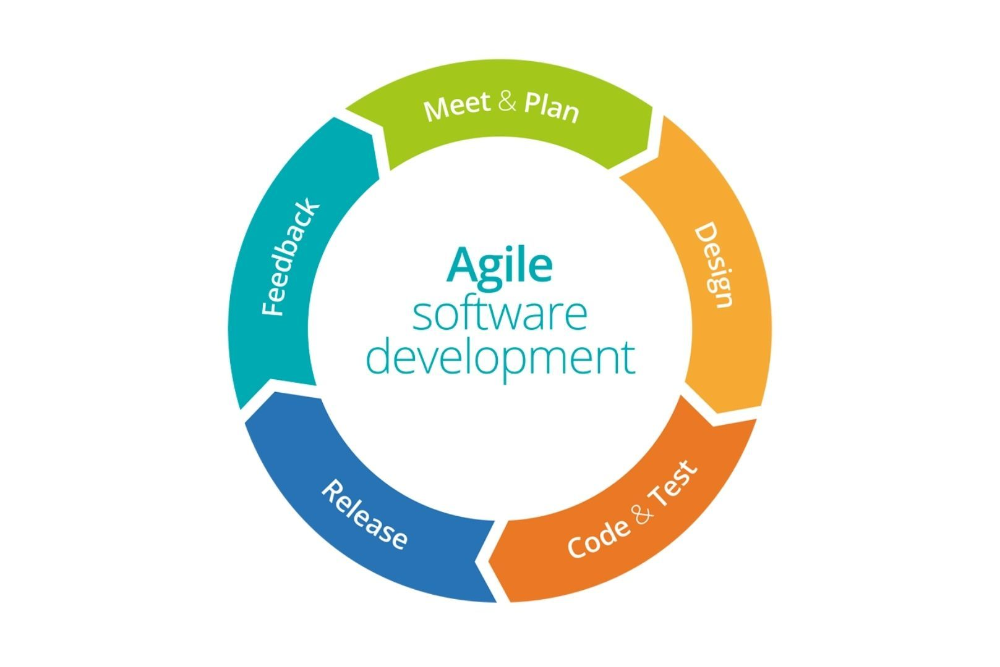

## Introduction

My ICS314 class was a good class, and it was an even better learning experience. ICS314 taught me a lot about software engineering, and those lessons go even further than just software development work. From breaking down work into more manageable tasks, to being able to effectively work in groups, I have taken away things from software engineering that I want to apply more in my daily life. 

## Agile Project Management

In ICS314, we learned about agile project management. Agile project management is a software development methodology in which project development is done in two week sprints. This means that every two weeks, the team works on building and implementing features for the project, and then planning what issues need to be worked on in the next sprint. This cycle of development, implementation, and planning is the crux of agile project management. For my final project in ICS314, my team did agile development using Issue Driven Project Management (IDPM). With IDPM, we broke down each task into issues on GitHub. We organized issues into “To-Do,” “In Progress,” and “Done” with GitHub Project Boards. Agile project management helped teach me how to break big problems into smaller, more manageable pieces that are easier to tackle one by one. I want to apply this strategy of breaking down problems in anything I want to accomplish, whether it be landing a software developer role, or learning how to play a new instrument. 

## Open Source Software Development

We also learned about open source software development in ICS314, and how to use and develop open source software properly. Open source software development is where developed software is available and visible to the public, and can be accessed and modified by anyone. I learned that in open source development, it’s important to be able to communicate effectively. In 314, we worked on this by learning how to ask smart questions. It’s important to know how to ask a smart question in open source development because during the development process, you’ll eventually run into problems that you don’t know how to solve. In order for someone else either in your development team or other people online, you’re going to have to know how to properly communicate what you’re struggling with so they can do the best to try and help you. Knowing how to ask good and specific questions is a skill that’s valuable not only in software development, but in life in general because I know that I will have to seek out knowledge from other people to get to where I want to be in life. Effective communication through asking good questions will help me learn better and faster than if I were to struggle by myself.  

## Conclusion

Software engineering has taught me a couple of valuable skills that will benefit me not only in the career I want to pursue, but in my life as a whole. I’m grateful that I’ve had the opportunity to take ICS314 because it’s given me more knowledge in the field that I want to work in in the near future. With these lessons, I want to become a better software developer and a better person, too.
