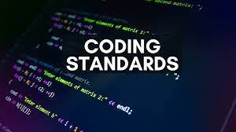

## The “Standard”

The coding standards I’ve been using for the past week or so has been the AirBnb style in Typescript. The AirBnb style is a popular coding standard used for Javascript, and this style can be enforced in an IDE using ESLint and Prettier for formatting. With configuring this coding style within a Typescript project, your code must adhere to these strict set of syntax and formatting rules; one misstep throws an error. 

One example of an AirBnb style rule is that you must have one empty line at the end of your file. If you don’t, your editor will display an error telling you “Newline required at end of file but not found.”

Example from one of my Typescript files:

```
console.log(zipListTheFunctionalWay(['a', 'b', 'c'], [1, 2, 3])); // Error: Newline required at end of file but not found.
```

Another rule within the AirBnb style is that all strings must be typed using single-quotes instead of double-quotes. Like the first example, your editor will display an error when you try to type a string using double-quotes.

```
console.log("Error: Lists must be of the same length"); // Error: Strings must use singlequote.
```

One more rule I’ll cover within the AirBnb style is that you’re not allowed to have more than one blank line in between two lines of code. This will also display an error in your editor.

```
    }
}

     // Error: More than 1 blank line not allowed.
console.log(zipList(['a', 'b', 'c'], [1, 2, 3]));
```

Here’s a link to a GitHub page that shows every rule in the AirBnb Javascript Style:
<a href="https://github.com/airbnb/javascript">https://github.com/airbnb/javascript</a>

## My opinion on “The Standard”

My feelings towards the AirBnb Javascript style are mixed at best. While I do agree that these coding standards can help beginners code cleaner, more readable Typescript, I think that most of the rules are too nitpicky. From personal experience, addressing these minute syntax suggestions can hinder actual coding productivity. I’m not sure that having people spend their time dealing with little errors like “Trailing spaces not allowed” helps them truly learn the language they’re trying to code in. I think it just results in a more stressful experience, a lot more stressful than it needs to be. 

When I was doing a timed coding assignment in my software engineering class, I had to create an object. I make the class for the object, declare its properties, and write the constructor. Everything’s fine right? **Wrong.** ESLint displayed an error because I didn’t add a newline in between each class property. 

Sample code because I can’t show the actual code from the assignment:

```
fullName: string;
phoneNumber: number; // Expected blank line between class members
isHuman: boolean; // Expected blank line between class members
```

Given that I was in a time crunch and I still had to implement two functions in 30 minutes, this seemingly unimportant nuisance added more stress to an already stressful coding experience. With code policing like this, the little errors can add up into a big ball of stress. In short, I’m not a big fan of the AirBnb style.

## Final Verdict

The AirBnb Style should not be the standard to adhere to while coding. I think that learners of Javascript/Typescript will be fine not using a linter that screams at you for every slight mishap. Given that I initially learned Typescript from YouTube, most courses already teach you how to code in a pretty clean way. So I must ask, why should the “standard” be the standard? It makes coding less fun, more restrictive, and more stressful. I know that it isn’t fun all of the time, but I don’t see the point in making it even less fun by making yourself delete trailing spaces.
