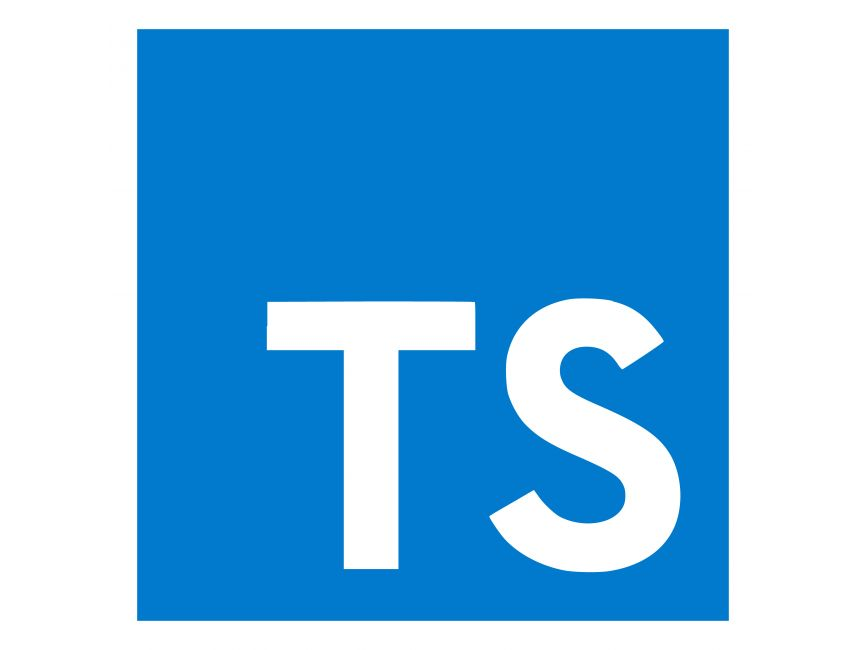

# TypeScript Learning Reflection
<br>
 


## Intro

TypeScript has been pretty fun to learn about. While I have had previous experience working with TypeScript in React, I never really took the time to slowly learn the different quirks and syntax like I have this past week. As a matter of fact, I'm still learning new things in TypeScript. I honestly had no idea that you could assign multiple return types to a function! I believe that as of right now, TypeScript is just an overall better version of vanilla JavaScript, mainly because of the explicit type system.

**Example of function with multiple return types:**
```typescript
function firstElement<Type>(arr: Type[]): Type | undefined {
   return arr[0];
}
```
*(code from typescriptlang.org)*

## What I Like in TypeScript

Again, the main thing that I love about TypeScript is the explicit type system. JavaScript is a dynamically typed language, which means that variables don't possess a strict data type. Because of this, you can declare a variable with one data type, but then you can set it to another data type, and this won't return an error. 

**Example code:**
```javascript
let foo = 67;
foo = "hello";
```

However, if you try the above code in TypeScript, it will print an error that reads "Type 'string' is not assignable to type 'number'."


Being restricted from the ability to assign a different data type to a variable reduces the amount of errors you are able to create, which is a good thing for writing cleaner code. Another piece to note from the code snippet above is the `: number` portion. In TypeScript, you can explicitly define the data type for a variable (this can also be done with functions). This is good because it results in clearer code and code that's easier to read. This is a reason why I really like the explicit type system.

Another thing that I like about TypeScript is that the syntax is very easy to understand and pick up. The syntax is basically exactly like JavaScript, and if you aren't that familiar with JavaScript, then it's very similar to Java's syntax (as you would probably assume). Having simple syntax makes it easier to just write code, without having a bunch of overhead thinking about the right way to code something.

## Comparison to Other Languages

In comparison to Java, TypeScript is definitely a more enjoyable coding experience. There is less boilerplate code ("sections of code that are repeated in multiple places with little to no variation") to type in TypeScript, compared to Java, which has the most boilerplate out of all of the coding languages I've used. While Java has more uses in different industries than TypeScript, I'm basing this off of my experience with both languages. And so far, I have had more fun using TypeScript than Java.

Compared to Python, I think that I enjoy Python a bit more than TypeScript. One of my reasons for this is because Python has even simpler syntax than TypeScript. Another reason is because Python is used in a wide range of fields such as:
- Machine learning and artificial intelligence
- Web development
- Data science/analysis

Python is also a great language for coding interviews because of its overall simplicity. All in all, I think I still enjoy Python a bit more.

## Conclusion

With the other languages that I've programmed with, TypeScript is one of the best. Its straightforward syntax and static type system make it truly great to work with. I can't wait to work on more projects with it.

*AI was used in formatting this essay, and for this essay's grammar.*
